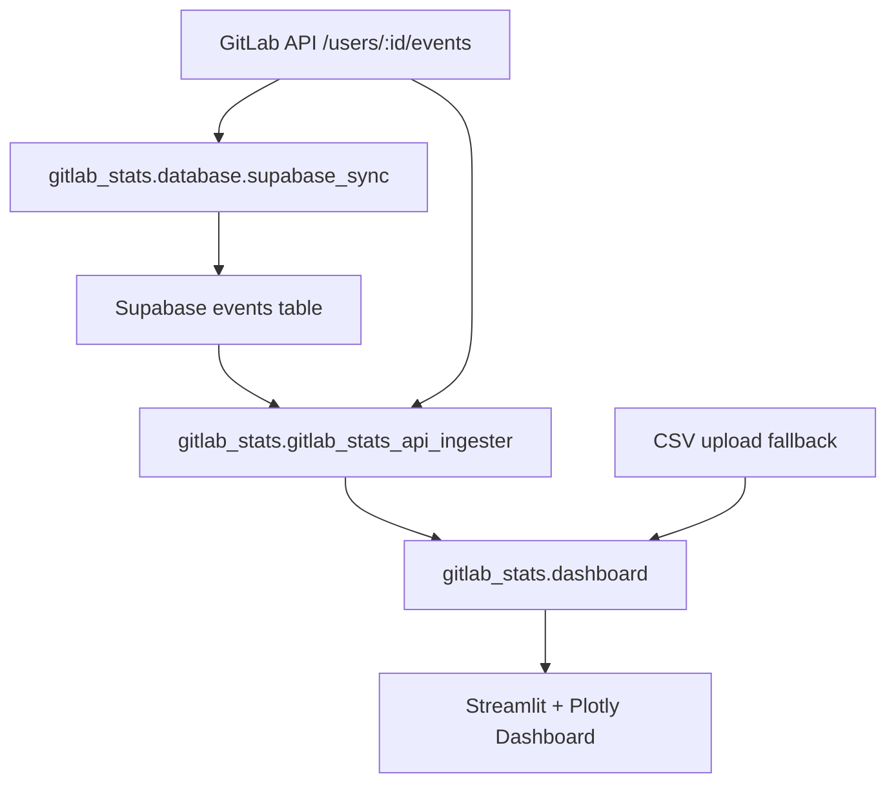

# GitLab Stats

GitLab Stats is a Streamlit dashboard package for visualizing GitLab contribution activity.

The current package is built around a Supabase-first data flow:

- Sync normalized GitLab API events into Supabase (HTTPS only)
- Rebuild project metrics and behavior timelines from Supabase event rows
- Fall back to direct GitLab API reads when enabled
- Fall back to uploaded CSV only when live sources are unavailable

## Table of Contents

- [What Is Included](#what-is-included)
- [Architecture](#architecture)
- [Requirements](#requirements)
- [Installation](#installation)
- [Configuration](#configuration)
- [Usage](#usage)
- [Timeframe Controls](#timeframe-controls)
- [Windows Task Scheduler (Recommended)](#windows-task-scheduler-recommended)
- [Planned Next Branch](#planned-next-branch)
- [Project Structure](#project-structure)
- [Development](#development)
- [License](#license)

## What Is Included

- Supabase-first dashboard loading (`USE_SUPABASE = True` by default)
- GitLab API ingestion and normalization pipeline
- Supabase sync CLI for scheduled backfills
- Streamlit + Plotly interactive analytics dashboard
- Behavior analysis from real timeline data
- Dynamic timeframe selector (7-day minimum up to all available history)
- CSV upload fallback for offline viewing/export replay
- Pre-commit, linting, and test tooling via Poetry

## Architecture



## Requirements

- Python 3.11+
- Poetry
- Git
- A GitLab Personal Access Token
- A Supabase project URL and service role key

## Installation

1. Clone the repository.

```bash
git clone <repository-url>
cd gitlab_stats
```

1. Install Poetry (Windows helper script is included).

```powershell
.\tools\install_poetry.bat
```

1. Set up the environment and hooks.

```powershell
.\tools\after_checkout.bat
```

## Configuration

Create a `.env` file in the repository root:

```bash
# Supabase (required for Supabase-first mode)
SUPABASE_URL=https://<your-project>.supabase.co
SUPABASE_SERVICE_ROLE_KEY=<your-service-role-key>

# GitLab API (required for sync and API fallback)
GITLAB_API_BASE_URL=https://<your-gitlab-host>/api/v4
GITLAB_API_TOKEN=<your-gitlab-personal-access-token>
```

Primary runtime flags are in `gitlab_stats/config.py`:

- `USE_SUPABASE`: Load dashboard metrics from Supabase first
- `USE_API`: Allow API fallback when Supabase is unavailable
- `SHOW_DATA_SOURCE_INFO`: Show source/timing banners in the UI
- `SUPABASE_LOOKBACK_DAYS`: Supabase read window for timeline/metrics
- `API_LOOKBACK_DAYS`: API event lookback window
- `API_EVENTS_PER_PAGE`: GitLab events page size (max 100)
- `API_MAX_EVENT_PAGES`: Upper bound on paginated API fetches
- `DATA_CACHE_TTL_SECONDS`: Streamlit cache TTL for expensive loads
- `STREAK_HOLIDAY_COUNTRY`: Optional ISO country code for holiday-aware streaks

## Usage

Deployed dashboard:

- <https://git-lab-stats-cl.streamlit.app/>

Run the dashboard:

```bash
poetry run streamlit run gitlab_stats/dashboard.py
```

Run a one-time sync from GitLab API into Supabase:

```bash
poetry run python -m gitlab_stats.database.supabase_sync
```

Open the dashboard at the local Streamlit URL (usually `http://localhost:8501`).

### Data Source Behavior

Load order is:

1. Supabase (if enabled and credentials exist)
2. GitLab API (if enabled and credentials exist)
3. Uploaded CSV fallback (only after live-source failure)

The dashboard also provides a `Refresh Data Cache` button to clear Streamlit cache and re-fetch data.

## Timeframe Controls

The dashboard includes a dynamic timeframe selector shown above the Executive Summary.

- Presets: Last 7 days, Last 30 days, Last 90 days, Last 6 months, Last 1 year, YTD, All time, Custom
- Minimum window: 7 days
- Maximum window: all available contribution history (earliest to latest date available)

Behavior-analysis chart visibility is window-aware:

- Weekly Contribution Mix is hidden for windows shorter than 4 weeks
- Monthly Contribution Volume is hidden for windows shorter than 2 months

## Windows Task Scheduler (Recommended)

For internship-period automation, schedule the Supabase sync command at login or daily:

```powershell
poetry run python -m gitlab_stats.database.supabase_sync
```

Suggested scheduler settings:

- Trigger: At log on (or daily)
- Run whether user is logged on or not (if permissions allow)
- Start in: repository root directory
- Redirect output to a log file for troubleshooting

## Planned Next Branch

Highest-priority upcoming change is Grafana integration in a separate branch.

Current plan:

- Reuse existing GitLab ingestion + normalization pipeline
- Reuse Supabase event table as the primary data source for Grafana panels
- Rebuild visualization layer in Grafana while keeping the current Streamlit dashboard stable

## Project Structure

```bash
gitlab_stats/
├── README.md
├── LICENSE
├── pyproject.toml
├── poetry.toml
├── doc/
│   ├── changelog_prompts.txt
│   ├── markdownlint_report.txt
│   └── pylint_report.txt
├── gitlab_stats/
│   ├── __init__.py
│   ├── config.py
│   ├── dashboard.py
│   ├── gitlab_stats_api_ingester.py
│   ├── settings.py
│   ├── dashboard_utils/
│   │   ├── activity_rules.py
│   │   ├── charts.py
│   │   ├── helpers.py
│   │   ├── metrics_schema.py
│   │   ├── sections.py
│   │   └── timeline_utils.py
│   └── database/
│       ├── __init__.py
│       ├── supabase_client.py
│       └── supabase_sync.py
├── test/
│   ├── __init__.py
│   └── test_gitlab_stats.py
└── tools/
    ├── __init__.py
    ├── after_checkout.bat
    ├── install_poetry.bat
    └── pylint_reporter.py
```

## Development

Run all quality checks:

```bash
poetry run pre-commit run --all-files
```

Run focused linting:

```bash
poetry run pylint gitlab_stats/dashboard.py gitlab_stats/gitlab_stats_api_ingester.py
```

Run tests:

```bash
poetry run pytest
```

## License

This project is licensed under the MIT License. See [LICENSE](LICENSE).
