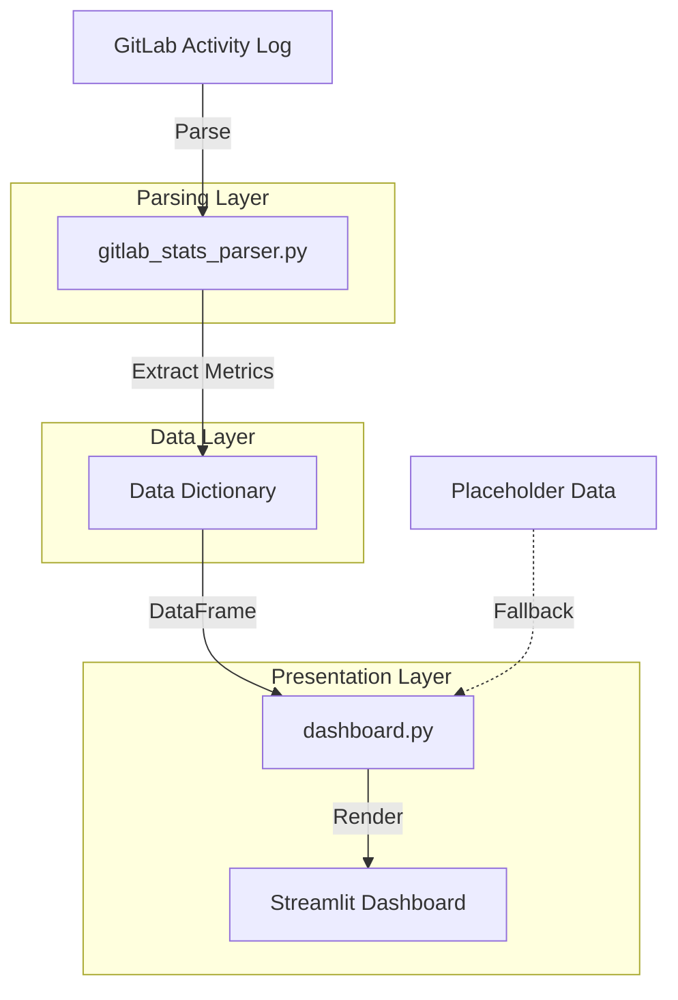

# GitLab Stats

A comprehensive dashboard for visualizing and analyzing GitLab contribution statistics.
Parse GitLab activity logs and gain insights into your development patterns,
collaboration metrics, and project contributions.

## Table of Contents

- [Features](#features)
- [Description](#description)
- [Architecture](#architecture)
- [Installation](#installation)
  - [Prerequisites](#prerequisites)
  - [Setup Instructions](#setup-instructions)
  - [Pre-commit Hooks](#pre-commit-hooks)
- [Usage](#usage)
  - [Running the Dashboard](#running-the-dashboard)
  - [Data Format](#data-format)
  - [Placeholder Data](#placeholder-data)
- [Project Structure](#project-structure)
- [Contributing](#contributing)
  - [Branch Strategy](#branch-strategy)
  - [Development Workflow](#development-workflow)
  - [Commit Standards](#commit-standards)
- [License](#license)

## Features

- **Contribution Parsing**: Automatically parse GitLab activity logs to extract contribution data
- **Visual Dashboard**: Interactive Streamlit-based dashboard with real-time visualizations
- **Contribution Metrics**: Track commits, merge requests, branches, issues, and collaboration activities
- **Per-Project Breakdown**: Analyze contributions by individual projects
- **Code vs Collaboration Split**: Visualize the balance between direct code contributions and collaborative activities
- **Placeholder Data**: Built-in fallback with sample data for development and testing
- **Pre-commit Integration**: Automated code quality checks and formatting

## Description

GitLab Stats is a Python package that transforms raw GitLab contribution logs into actionable insights. It provides:

1. **Data Parsing**: Extracts project names, action types, and contribution counts from GitLab activity files
2. **Metrics Calculation**: Computes comprehensive statistics including:
   - Total contributions per project
   - Code contributions (commits, branches)
   - Collaboration contributions (merge requests, issues, reviews)
   - Code vs collaboration percentages
3. **Interactive Visualization**: Presents data through a Streamlit dashboard with:
   - Overall summary metrics
   - Per-project breakdown tables
   - Contribution charts and comparisons
   - Deep-dive project analysis

## Architecture



**Key Components:**

- **gitlab_stats_parser.py**: Core parsing and metrics engine
  - Regex-based log parsing
  - Contribution classification
  - Aggregation and computation
- **dashboard.py**: Streamlit web interface
  - File input handling
  - Data visualization
  - Interactive filtering
- **gitlab_contributions_placeholder.txt**: Sample dataset for testing and demo purposes

## Installation

### Prerequisites

- Python 3.11 or higher
- Git
- Poetry (optional but recommended)
- Windows PowerShell (for batch scripts)

### Setup Instructions

1. **Clone the repository:**

   ```bash
   git clone <repository-url>
   cd gitlab_stats
   ```

2. **Install Poetry version:**
   - On Windows, run the install script:

     ```powershell
     .\tools\install_poetry.bat
     ```

   - This ensures the correct Poetry version is installed on your system

3. **Run post-checkout setup:**
   - On Windows:

     ```powershell
     .\tools\after_checkout.bat
     ```

   - This will:
     - Set up your virtual environment
     - Install all dependencies
     - Download and configure pre-commit hooks

### Pre-commit Hooks

The project includes comprehensive pre-commit hooks that automatically:

- Check Python syntax and code quality (Ruff, Pylint)
- Format code (Black, isort, autopep8)
- Check YAML and TOML files
- Fix spelling issues (typos, codespell)
- Run unit tests
- Validate commit messages

Pre-commit hooks run automatically before each commit. To manually run all checks:

```bash
poetry run pre-commit run --all-files
```

All `.txt` files are excluded from pre-commit processing to prevent issues with data files.

## Usage

### Running the Dashboard

Activate your Poetry environment or run directly with Poetry:

```bash
poetry run streamlit run gitlab_stats/dashboard.py
```

The dashboard will launch at `http://localhost:8502`

### Data Format

GitLab Stats expects a text file with GitLab activity logs in the following format:

```bash
[User] [action] at [project-name]
[User] pushed to branch [branch-name] at [project/name]
... and X more commits
```

Example:

```bash
Avery pushed to branch orbit at nova-studio/helium-garden
... and 4 more commits
Avery opened merge request !23 at nova-studio/helium-garden
Jordan pushed new branch comet-ui at terra-works/aurora-cafe
```

Supported actions:

- `pushed to branch` - Commit pushed
- `pushed new branch` - New branch created
- `deleted branch` - Branch deleted
- `opened merge request` - MR created
- `accepted merge request` - MR merged
- `approved merge request` - MR approved
- `commented on merge request` - MR comment
- `opened issue` - Issue created

### Placeholder Data

If the actual contribution file is not found, the dashboard automatically falls back to placeholder data
A warning banner will display indicating that you're viewing sample data.

The default file path is: `gitlab_stats/gitlab_contributions.txt`

To use a custom file path, enter it in the text input field in the dashboard.

## Project Structure

```bash
gitlab_stats/
├── .gitignore              # Git ignore rules
├── .pre-commit-config.yaml # Pre-commit hook configuration
├── .pylintrc               # Pylint configuration
├── .yamlfmt                # YAML formatting config
├── pyproject.toml          # Poetry dependencies and project config
├── poetry.lock             # Locked dependency versions
├── README.md               # This file
├── LICENSE                 # Project license
├── gitlab_contributions.txt   # This file is not in the repo but needs to added and contain your gitlab data
├── gitlab_stats/           # Main package
│   ├── __init__.py
│   ├── dashboard.py        # Streamlit dashboard UI
│   ├── gitlab_stats_parser.py     # Core parsing and metrics engine
│   └── gitlab_contributions_placeholder.txt  # Sample data
├── test/                   # Test suite
│   ├── __init__.py
│   └── test_gitlab_stats_parser.py
├── tools/                  # Development utilities
│   ├── after_checkout.bat  # Post-checkout setup script
│   ├── install_poetry.bat  # Poetry installer script
│   └── pylint_reporter.py  # Pylint reporting tool
└── doc/                    # Documentation
    ├── changelog_prompts.txt
    ├── markdownlint_report.txt
    └── pylint_report.txt
```

## Contributing

We welcome contributions! Please follow these steps to ensure smooth collaboration and maintain code quality.

### Branch Strategy

- **Main branch**: Production-ready code
- **Develop branch**: Integration branch for features and fixes
- **Feature/fix branches**: Always branch off from `develop`

### Development Workflow

1. **Prepare your environment:**
   - Run the install_poetry.bat file located in the `tools/` folder to force the correct Poetry version onto your system
   - Run the `after_checkout.bat` file to:
     - Set up your virtual environment
     - Download and install all dependencies
     - Configure pre-commit hooks

2. **Create your feature branch:**

   ```bash
   git checkout develop
   git pull origin develop
   git checkout -b feature/your-feature-name
   ```

3. **Make your changes:**
   - Write clear, well-documented code (and tests)
   - Run pre-commit checks: `poetry run pre-commit run --all-files`

4. **Merge develop into your branch (before opening PR):**

   ```bash
   git fetch origin
   git merge origin/develop
   ```

5. **Push and open a Pull Request:**

   ```bash
   git push origin feature/your-feature-name
   ```

   - Open your pull request against the `develop` branch
   - Provide a clear description of your changes
   - Ensure all CI checks pass

### Commit Standards

Keep your commits clear and descriptive. Use [Conventional Commits](https://www.conventionalcommits.org/) standard when possible.

**Commit types:**

- `feat:` - A new feature
- `fix:` - A bug fix
- `docs:` - Documentation changes
- `style:` - Code style changes (formatting, missing semicolons, etc.)
- `refactor:` - Code refactoring without feature or bug fixes
- `perf:` - Performance improvements
- `test:` - Adding or updating tests
- `chore:` - Build, CI, or dependency changes
- `build:` - Changes to build system or dependencies
- `ci:` - CI/CD configuration changes
- `tools:` - Changes to development tools and scripts

**Examples:**

```bash
feat: add project contribution filtering
fix: handle missing branch data in parser
docs: update README with architecture diagram
style: format dashboard code with Black
refactor: extract metrics computation into separate function
```

**Before committing:**

- Ensure code follows project style (Black, isort, autopep8)
- All tests pass
- No linting errors
- Commit messages are descriptive and follow the convention

## License

This project is licensed under the MIT License - see the [LICENSE](LICENSE) file for details.

---

For questions or issues, please open a GitHub issue or contact the maintainers.
